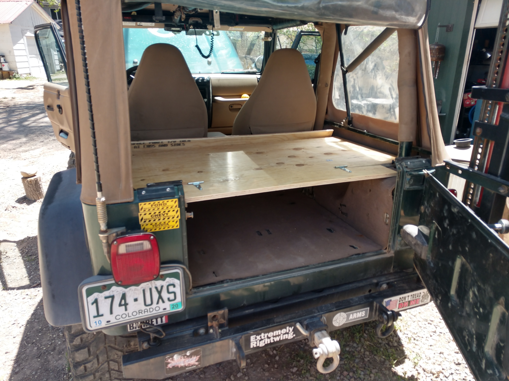
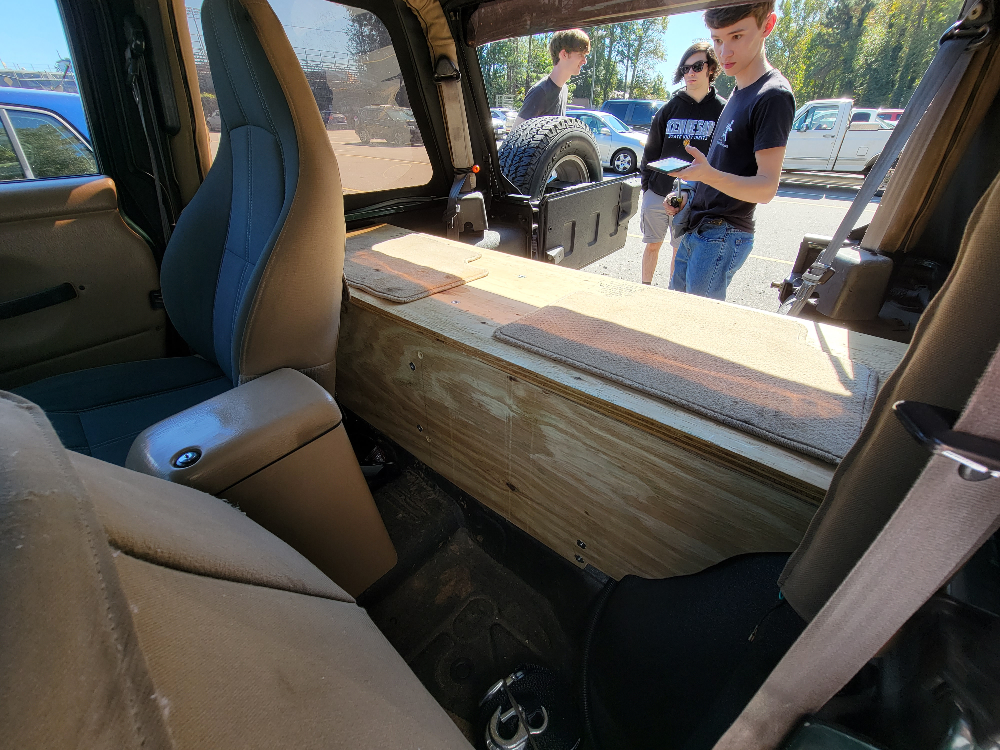
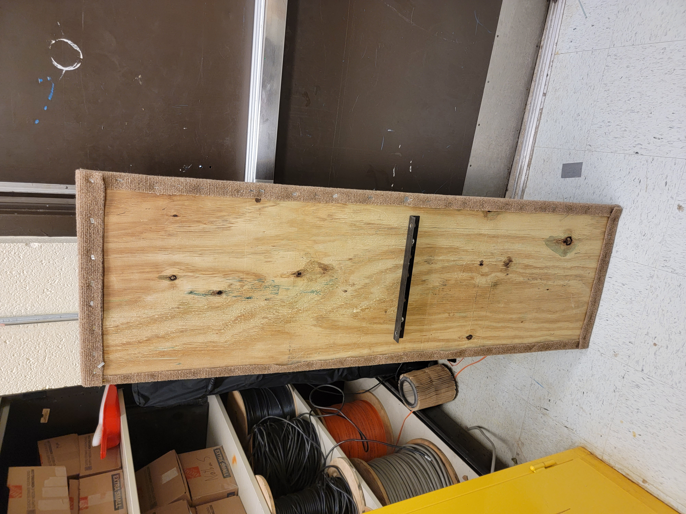
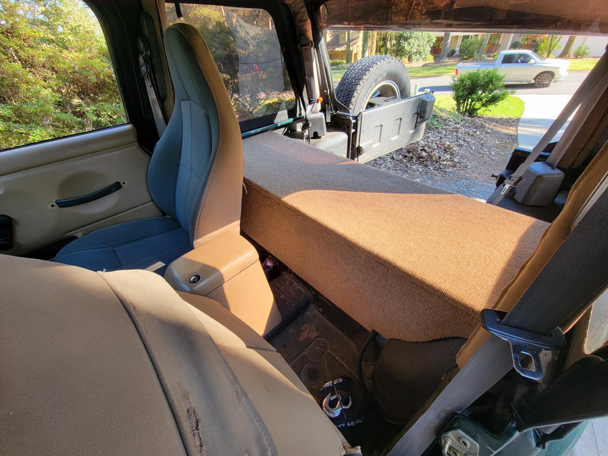

# The Problem

I have a small car and I want to be able to carry a lot of things. My 2000 Jeep Wrangler isn't a very long car, and fitting a back seat in there only leaves so much cargo space. The original area leaves about a 1' x 1' x 4' compartment behind the seat, and with my subwoofer, that cuts my useable space in half. Since I don't carry that many people often, I wanted to remove the back seat and replace it with a storage system that provided space for my subwoofer, and things like tools and camping gear. The box had to be the right dimensions to fit all of these items, along with my desire to have it be a non-permanent solution, in the event that I want to drive more than one other person.

# Research

Other people have done similar solutions, so we looked at some examples on the internet for inspiration. We took cues for the general shape of the box and how it was put together, and then thought about what we could do to make it removable, avoiding screws and nails.

### This example shows a good example for the shelf depth

### This example shows the back panel shaped to the body contour, which we incorporated into our plan

### This shows a great full-depth shelf. We ultimately decided against this approach, as I wanted the ability to carry tall objects or to stack things.

# Design

I wanted to follow the same general shape and style of both projects above, featuring a back wall on the box, and a divider in the middle to provide a little more organization. The top shelf is placed an inch off the body using deck board, and the shelf is 18" deep, which is a good medium between useful for larger things, and smaller items. A small strip of board will be placed on the front and back sides of the shelf to keep things inside.

The bottom left side of the shelf will be used to store my subwoofer and amp, requiring enough space for the width of the sub, and room to mount the amp on the bottom of the shelf. This area will later be used to split off the power coming from the battery for other accessories like an inverter or air compressor.

# Execution

We started by building the back panel of the shelf, as this was the most complicated part of the shelf and set a lot of the dimensions for the rest of the project. To create the shape on contour that would follow the body lines on the inside, we used a reasonably stiff piece of cardboard and slowly cut and adjusted the shape of it to fit snug against the body. After we were happy with the fit, we measured the distance between the walls of the tub, and then transferred the shape from the cardboard to a sheet of plywood at the same distance as the width of the tub. We also added a cut out in the bottom corner to allow for the power wires for the amp to come through. The piece was attached using a simple shelf bracket, attached to the plywood using T-nuts and machine screws, and secured the body using self tapping screws. Care was maintained when drilling the holes for the tapping screws so that we weren't going to hit the gas tank.

## Top Shelf

The top shelf was the next part, taking the width of the top part of the tub by 18 inches to get the piece. We set up the parts that would secure it to the body by putting two small pieces of deck board (1" thick) on either side of the body to space it enough for the subwoofer to fit underneath. We fastened the boards using countersunk machine screws, which went through holes drilled into the fenders, and were secured in the fender well using nylock nuts.

## Divider

The middle divider was made using the shelf depth and height, and is attached using angle iron to both pieces with machine screws and T nuts on both sides. A piece of aluminum box tube was milled to create a U shape that would be affixed to the bottom of the divider with the intention of securing it to the body to pull the shelf down in the middle. We ended up not securing this bottom piece to the body, as it was not necessary to make the shelf sturdy.

## Carpeting

Along this process, we used beige needle punch carpet to cover the pieces to provide an aesthetic design and match the color of the interior. Over large faces we secured it using spray adhesive, and stapled the rest over the corners of the pieces.

Only the top of the shelf and the backside of the back panel were carpeted, because these would be the most visible sides of each piece.

## Securing the top shelf

The top shelf had yet to be secured to anything. Wanting to keep the whole structure relatively easy to remove, we decided on using window latches due to their ability to center and pull each side of the latch. This helped keep it easy to remove and also provided pressure downward so that the shelf wouldn't rattle due to the subwoofer.

## Border strip

Finally we added the border along the front and back sides of the top shelf. We used 1x2 finishing wood, and initially used finishing nails from the underside to secure it. These proved to not be strong enough, and was later helped with screws to pull the strip down and keep it secure. A notch was cut into one end of each strip so that it would fit under the lip of the tub, and be able to be removed with the top shelf.

## Securing the subwoofer

The last thing to complete the structure was to add some blocking so that the subwoofer wouldn't slide around. We cut some mdf and screwed it into the top shelf to create a little cage. The amp was screwed to the underside of the shelf towards the outside.

# Final Product

Below are some pictures illustrating the final look of the shelf.

One issue in completing the project was getting the magnet to work on keeping the tailgate shelf stowed. The plywood shelf itself is warped and the magnet isn't strong enough to keep the shelf pulled up. In the future I'd like to get a stronger magnet with more surface area, and use a different kind of wood.

**The biggest issue** in completing the project was dealing with warped wood. We initially chose pressure-treated plywood due to it's durable and outdoor-friendly nature. A big issue with PT lumber is that when the pieces dry they tend to warp. This made squaring up the structure difficult and doing anything with accuracy challenging. In hindsight, we should have used regular plywood, or ideally, marine grade plywood, which is assembled with waterproof glue as oppose to being pressure treated, so it doesn't warp.

# Gantt Chart

<embed src="https://docs.google.com/spreadsheets/d/1jOgEgcvvYcYgz9fnuyEvaMqUXnx0NUyPBKZbR_VgBRY/edit?usp=sharing" width="100%" height="800"/>
